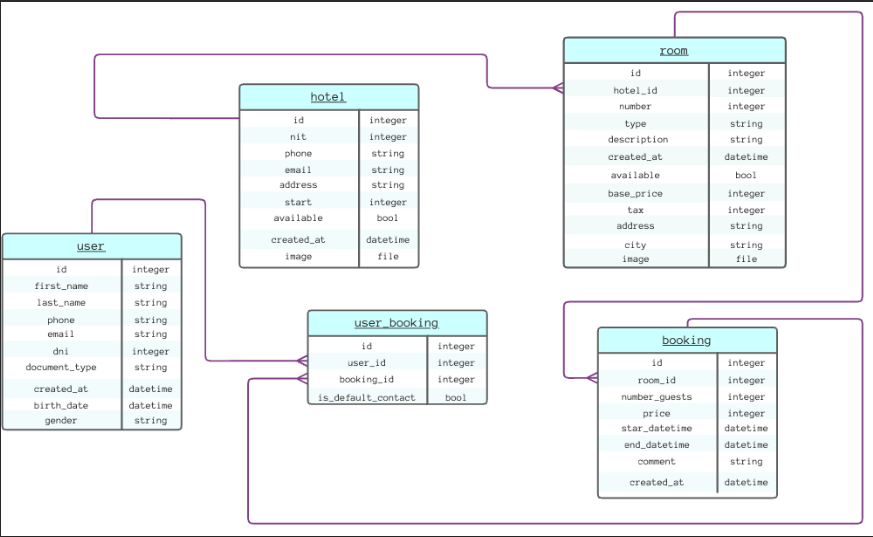

# 360 Exploration Web App

(Prueba Técnica para Vacante 22028)

Este repositorio contiene el código fuente de una aplicación web de gestión de hoteles y hospedajes desarrollada utilizando React JS. La aplicación permite realizar operaciones de CRUD en hoteles y habitaciones, además de mostrar reservas realizadas a través de la página de reservas de la agencia de viajes.

## Tecnologías Utilizadas

- React JS
- React Redux
- React Icons
- Moment.js
- React Bootstrap
- React Router DOM
- Redux Persist
- Redux Thunk
- TypeScript
- SweetAlert2

## Patrones de Diseño y Buenas Prácticas

Durante el desarrollo de esta aplicación, se han aplicado los siguientes patrones de diseño y buenas prácticas:

- **Patrón Render**: Se ha utilizado la técnica de renderizado condicional para mejorar la eficiencia de la aplicación.

- **Composición**: Los componentes se han diseñado de manera modular y reutilizable para fomentar la composición de elementos en la interfaz de usuario.

- **Custom Hooks**: Se han creado hooks personalizados para abstraer la lógica de la aplicación y facilitar su reutilización en diferentes partes de la aplicación.

- **Patrón de Carga de Datos**: Se ha implementado un patrón de carga de datos para garantizar una experiencia de usuario fluida, cargando datos de manera eficiente.

## Mock API

Para simular las llamadas a API durante el desarrollo, se ha utilizado la herramienta en línea "mockapi.io" para crear endpoints de API ficticios que siguen la estructura esperada por la aplicación.

## Diagrama de Entidad-Relación

Se ha elaborado un Diagrama de Entidad-Relación (ERD) utilizando "draw.io" para representar la estructura de datos de la aplicación. Esto ha ayudado en la comprensión de la relación entre las entidades como hoteles, habitaciones y reservas.

## Despliegue

La aplicación se ha desplegado en Azure Static Web App para garantizar su disponibilidad y rendimiento. Puedes acceder a la aplicación en [https://lively-desert-0315dfc0f.3.azurestaticapps.net](https://lively-desert-0315dfc0f.3.azurestaticapps.net/).

## Contribución

Si deseas contribuir a este proyecto, sigue estos pasos:

1. Clona este repositorio.
2. Crea una rama para tu funcionalidad o corrección de errores: `git checkout -b feature/nueva-funcionalidad` o `git checkout -b fix/correccion`.
3. Realiza tus cambios y asegúrate de seguir las convenciones de nombres y estructura del proyecto.
4. Realiza un pull request detallado describiendo tus cambios.

## Pasos para Ejecutar la Aplicación Localmente

Si deseas ejecutar la aplicación en tu entorno de desarrollo local, sigue estos pasos:

1. Clona este repositorio.
2. Ejecuta `npm install` para instalar las dependencias.
3. Ejecuta `npm start` para iniciar la aplicación en modo de desarrollo.
4. Abre tu navegador y accede a `http://localhost:3000`.
